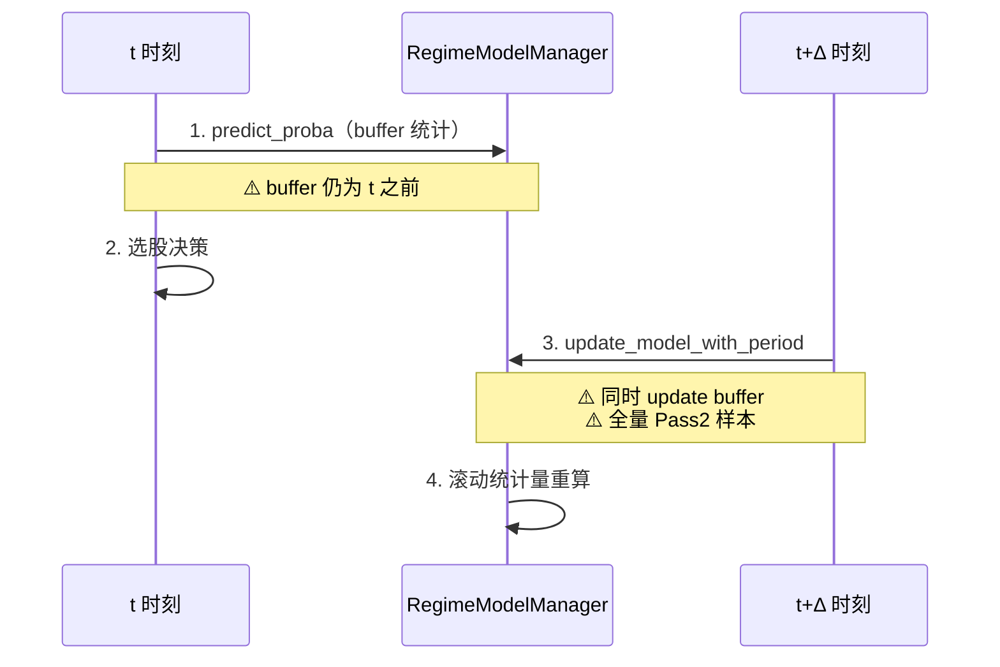

# AlphaHelix vs 开源生态：方向评估、差距分析与改进优先级

> 文档日期：2026-07-07
> 第一次更新：2026-07-07（含 Code Review 实证 + 优先级修正）
> 第二次更新：2026-07-07 19:00（**严肃 Code Review 修正**：推翻"GBDT 占位"与"P0-1 GBDT 替代线性加权"两个错误判断；基于实际回测数据 + 生产跑批日志重新定位）
> 输入材料：
> - 已有调研 [research_ai_agent_open_source_20260707.md](research_ai_agent_open_source_20260707.md)
> - 现有项目 [research.md](research.md) / [research_llm_stock_picking.md](research_llm_stock_picking.md) / [research_stock_picking_landscape.md](research_stock_picking_landscape.md)
> - 项目内部文档（system-design / architecture / agents / evolution / decisions / risk / roadmap）
> - 实际代码审计（scripts/screen.py / evaluate.py / weight_optimizer.py / market_defense.py / online_predictor.py / feedback_harness.py / llm_event_filter.py / gbdt_predictor.py / model_trainer.py / walkforward_gbdt.py / regime_adaptive_v2.py / two_stage_gbdt.py / factor_agent.py / factor_miner.py / ensemble_trainer.py）
> - **实际回测数据 memory/eval/gbdt_summary_20260706_*.json（105 周期）+ walkforward_20240101_20260615_regime_h10.json（30 周期）**
> - **生产跑批日志 memory/log/daily-screen-20260703-*.log**

---

## 1. 当前到底在造什么？（一句话定位）

**AlphaHelix = 在 HelixAgent 上的「量化主导 + LLM 辅助」的 A 股可落地的稳健型选股智能体**，核心是**先算后说**：

```
数据(Tushare) → 因子+策略(Python) → 候选池 → LLM 定性报告 → 选股快照
       ↑                                                          ↓
       └──────── Feedback Harness(因子权重+prompt)←── evaluate.py ──┘
```

**关键定位差异**：与 95% 的 GitHub 高星项目（TradingAgents / AI Hedge Fund / Qbot）**走的是相反方向**。这些项目是 **"LLM-as-trader"**（让 LLM 决定买卖），AlphaHelix 是 **"LLM-as-assistant"**（LLM 解释/补充/报告，决策权交给可验证的 Python 计算）。

这一定位选择由 [ADR-002](../decisions.md)（目录扫描 + Skill 集成）和 [ADR-003](../decisions.md)（LLM 不做数值计算）锁定。

---

## 2. 与开源项目范式对比

### 2.1 三大开源范式 vs AlphaHelix

| 维度 | LLM 角色化多智能体（TradingAgents/AI Hedge Fund） | LLM×RL（FinRL-DeepSeek/FLAG-Trader） | LLM 自动研发（RD-Agent/AlphaGen/AlphaAgent） | **AlphaHelix 当前位置** |
|---|---|---|---|---|
| 决策主体 | LLM 多 Agent 辩论 | DRL 策略网络 | LLM 写代码 → 回测筛选 | **Python 因子 + LLM 报告** |
| 因子来源 | 硬编码 + LLM 提建议 | 状态向量 | LLM 自动生成 RPN 表达式 | **手写 18+ 因子 + 硬编码 4 策略** |
| 可解释性 | 高（CoT+辩论） | 低（黑盒） | 中（生成的代码可读） | **高（因子 + LLM 报告）** |
| A 股适配 | 几乎全无 | 框架支持但需自接 | 学术为主 | **原生深度适配（T+1/涨跌停/印花税/历史 ST）** |
| 实战成熟度 | Demo 级（短窗口 demo） | 学术 benchmark | 学术 benchmark | **8 个月 walk-forward 实测** |
| 风险纪律 | 几乎无 | 学术风格 | 学术风格 | **C01–C38 严格纪律清单** |
| 自进化 | 无 | RL 自动 | LLM 自我迭代 | **Feedback Harness v1** |

### 2.2 最直接对标对象

| 项目 | 对 AlphaHelix 的关系 |
|---|---|
| **Qlib** | 范式兄弟（数据+因子+回测底座），但 Qlib 偏研究框架、AlphaHelix 偏 A 股生产化 |
| **Qbot** | 兄弟产品（中文+本地化），但 Qbot 无 regime/无 Feedback Harness/无纪律清单 |
| **StockAgent** | 兄弟产品（A 股 LLM 平台），但没做 walk-forward 与确定性评估 |
| **aiagents-stock** | 兄弟产品（A 股多 Agent），但依赖 LLM 决策、缺乏量化底座 |
| **TradingAgents** | 思路不同（LLM 决策）——**不应照搬**，但可借鉴辩论报告作为 LLM 解释层 |
| **AI Hedge Fund** | 同上，**不应照搬**（成本高、回测不严谨） |
| **RD-Agent** | **最该借鉴**：因子自动生成 + LLM 写代码 + 回测反馈 |
| **AlphaAgent** | **最该借鉴**：alpha decay 正则化机制 |
| **FinRL-X** | **值得借鉴**：weight-centric 架构解决回测—实盘一致 |
| **FinMem** | **可借鉴**：分层记忆 + 多维评分召回（解决当前 memory_search 痛点） |

---

## 3. 方向评估：对了什么、错了什么、缺了什么

### 3.1 方向**对**的部分

1. **「LLM 不做数值计算」纪律**（ADR-003 / C08）— 与业内共识一致，避免幻觉与 token 浪费。
2. **「LLM 负责推理，Python 负责计算」分层** — 是行业最佳实践。
3. **Walk-forward + 防穿越 + 样本外**（C01/C12/C13/C38）— 严于多数开源项目（TradingAgents 公开的"业绩"基本无此约束）。
4. **Regime 切换 + 动态权重**（**部分被 GBDT 取代**） — GBDT 满仓回测累计 +53%，优于 regime 切换的 linear 策略（-4.4%）；regime 切换的价值需要重新评估。
5. **Feedback Harness 闭环** — 走在多数 GitHub 项目前面（含 IC 计算、权重优化器、prompt 自适应）。
6. **GBDT 主链路已成熟**（**第二次更新补充**） — `walkforward_gbdt.py` 含完整 cost model（commission 0.0002 / stamp_tax 0.001 / slippage 0.001）、stop_loss、4 种权重方案、walk-forward 阈值校准；105 期回测累计 +53%——**这是 AlphaHelix 当前最大的工程资产**。
7. **A 股原生适配**（T+1 / 涨跌停 / 印花税 / ST 历史化）— 比国际项目更贴近实战。
8. **37 条纪律清单**（[risk.md §0](../risk.md)）— 工程严谨度极高。

### 3.2 方向**有问题**的部分（含 Code Review 实证 + 实际回测数据）

> 关键修正（第二次更新）：GBDT **不是占位**，而是有完整实现 + 实际回测 +53% 累计超额。**真正的 P0 不是"GBDT 替代线性加权"，而是"让生产 daily-screen 真正使用 GBDT"**——详见 §3.4。

| 问题 | 表现 | 根因 | 风险等级 | 代码证据 |
|---|---|---|---|---|
| **🔴 生产 daily-screen 未使用 GBDT（最严重）** | 20260703 跑批日志显示 agent 调用 `screen_candidates(strategy=momentum_value_hybrid, top_k=10)` **未传 `use_gbdt` 参数**；结果用 `total_score`（线性加权），不是 `gbdt_score` | (a) agent workflow 与实际执行不一致；(b) `screen.py` CLI 默认 `use_gbdt_model=False`；(c) GBDT 走 `walkforward_gbdt.py` Python 主链，生产走 `screen.py` CLI 链——**两条独立路径** | **🔴 最高** | [memory/log/daily-screen-20260703-*.log](file:///Users/onetwo/Documents/trae_projects/AlphaHelix/memory/log) + [alpha-analyst.md step 5](file:///Users/onetwo/Documents/trae_projects/AlphaHelix/.opencode/agent/alpha-analyst.md) + [screen.py:829](file:///Users/onetwo/Documents/trae_projects/AlphaHelix/scripts/screen.py#L829) |
| **🔴 显式未来函数（代码注释自承）** | [screen.py:510-512](file:///Users/onetwo/Documents/trae_projects/AlphaHelix/scripts/screen.py#L510-L512) 的 `add_sector_factors` 注释明确："行业分类来自 stock_basic，为当前分类。历史回测中若股票行业发生过变更，报告中的行业分布可能与历史真实分布存在偏差" | `industry` 字段取自当前 `stock_basic`，未做历史快照 | **🔴 C01/C38 红线** | [screen.py:510-512](file:///Users/onetwo/Documents/trae_projects/AlphaHelix/scripts/screen.py#L510-L512) |
| **🔴 LLM 文本因子数据合规风险** | [llm_event_filter.py:158-178](file:///Users/onetwo/Documents/trae_projects/AlphaHelix/scripts/llm_event_filter.py#L158-L178) 直接 `prompt = "..." + "\n".join(texts[:10])` 拼接公告原文，无脱敏 | 缺脱敏通道，违反用户规则"生产/开发数据隔离" | **🔴 C07 红线** | [llm_event_filter.py:158-178](file:///Users/onetwo/Documents/trae_projects/AlphaHelix/scripts/llm_event_filter.py#L158-L178) |
| **🟠 macro timing 拖累 GBDT 表现** | 同一 GBDT 模型，无 macro 缩仓 `[gbdt_summary_20260706_103739](file:///Users/onetwo/Documents/trae_projects/AlphaHelix/memory/eval/gbdt_summary_20260706_103739.json)` 累计 **+53%**；加 macro 缩仓 `[131258](file:///Users/onetwo/Documents/trae_projects/AlphaHelix/memory/eval/gbdt_summary_20260706_131258.json)` 累计 **+19%** | macro regime 缩仓过度（`avg_position_scale: 0.886`）——**累计超额砍了 60%** | **🟠 Major** | 两个 summary 对比 |
| **🟠 linear regime 策略实际累计负超额** | [walkforward_20240101_20260615_regime_h10.json](file:///Users/onetwo/Documents/trae_projects/AlphaHelix/memory/eval/walkforward_20240101_20260615_regime_h10.json) 30 周期：win_rate_excess 43.3%，**cumulative_excess_return -4.4%** | 线性加权 + regime 切换在 walk-forward 下未跑赢基准 | **🟠 Major** | [walkforward_20240101_20260615_regime_h10.json](file:///Users/onetwo/Documents/trae_projects/AlphaHelix/memory/eval/walkforward_20240101_20260615_regime_h10.json) |
| **🟠 防御信号与反馈闭环重叠矛盾** | `market_defense.py` 硬阈值 -0.3 触发 60% 减仓；`feedback_harness.py:131` 硬阈值 -0.08 触发"建议降低仓位" | 两套并行信号无统一协调 | **中高** | [market_defense.py:28-44](file:///Users/onetwo/Documents/trae_projects/AlphaHelix/scripts/market_defense.py#L28-L44) + [feedback_harness.py:121-133](file:///Users/onetwo/Documents/trae_projects/AlphaHelix/scripts/feedback_harness.py#L121-L133) |
| **🟠 GBDT 模型每次调用重载** | `gbdt_predictor.py:88` `lgb.Booster(model_file=...)` 无 LRU；`screen()` 每次都重新加载 | 缺模型缓存 | **中** | [gbdt_predictor.py:84-88](file:///Users/onetwo/Documents/trae_projects/AlphaHelix/scripts/gbdt_predictor.py#L84-L88) |
| **🟠 walkforward 回测潜在读取未来权重** | `load_dynamic_weights` 在 `AH_BACKTEST_MODE=1` 时强制返回 None；但 `walkforward.py` 未设置此环境变量 | 回测仍会读 `_latest.json`，有未来函数风险 | **中高（C01/C38 红线）** | [screen.py:798-820](file:///Users/onetwo/Documents/trae_projects/AlphaHelix/scripts/screen.py#L798-L820) + [walkforward.py](file:///Users/onetwo/Documents/trae_projects/AlphaHelix/scripts/walkforward.py) |
| **🟠 Agent prompt 与 CLI 默认值不一致** | [alpha-analyst.md step 5](file:///Users/onetwo/Documents/trae_projects/AlphaHelix/.opencode/agent/alpha-analyst.md) 写 `use_gbdt=true`；但 [screen.py:829](file:///Users/onetwo/Documents/trae_projects/AlphaHelix/scripts/screen.py#L829) CLI 默认 `use_gbdt_model=False` | agent 不传参数时回退到线性 | **中** | 同上 |
| **LLM 浪费在"报告生成"上** | 现状 LLM 80% 工作量是格式化 JSON 输出 | LLM 未用于信号提取、因子生成、RAG | **中高** | — |
| **多 Agent 协作未启动** | agents.md 显式写"单一主控 MVP" | 设计克制，但失去多视角校验能力 | **中** | — |
| **单 LLM 模型依赖** | agent 锁死 `kimi-for-coding/k2p7` | 无多模型对比、无 fallback | **中** | — |
| **memory_search 长期禁用** | agents.md 3.5 节标注 | HelixAgent 服务端 bug 阻塞 | **中** | — |
| **非结构化数据 0 接入** | Phase 7 仍列在"未来" | 新闻/研报/政策/情感信号未利用 | **中高** | — |
| **0 真实交易闭环** | C34 明确"当前不接实盘" | 合规/风险考虑，但实战反馈缺失 | **中** | — |

### 3.3 与开源范式比**缺**的

| 缺口 | 开源参考 | 影响 |
|---|---|---|
| 因子自动生成 | RD-Agent、AlphaGen | 因子库扩张依赖人工 |
| Alpha decay 显式建模 | AlphaAgent | 因子容易快速失效 |
| 回测—实盘统一接口 | FinRL-X | 未来切实盘可能踩坑 |
| 多视角报告 / 辩论 | TradingAgents | LLM 解释力单薄 |
| 新闻/研报情感信号 | FinGPT / FinMem | 丢失大量 alpha 源 |
| 风险事件 Agent | StockAgent 的六 Agent 协同 | 风控主要靠硬规则，缺定性判断 |

### 3.4 GBDT 实际生产状态（基于真实代码 + 回测数据）

> 关键修正（第二次更新）：之前的"GBDT 占位"判断是错的。下面是基于实际代码 + memory/eval 数据的事实陈述。

#### 3.4.1 GBDT 主链路（**已实现 + 已跑**）

| 文件 | 作用 | 状态 |
|---|---|---|
| [model_trainer.py](file:///Users/onetwo/Documents/trae_projects/AlphaHelix/scripts/model_trainer.py) | LightGBM / XGBoost / LambdaRank 训练器（regression / binary / lambdarank），`walk_forward_predict` 滚动预测，`walk_forward_predict_by_regime` regime-aware 滚动 | ✅ 完整 |
| [walkforward_gbdt.py](file:///Users/onetwo/Documents/trae_projects/AlphaHelix/scripts/walkforward_gbdt.py) | 生产回测主链：含 commission=0.0002 / stamp_tax=0.001 / slippage=0.001 成本模型、stop_loss、4 种权重方案（equal / score / risk_parity / score_risk）、walk-forward 阈值校准、行业中性化、宏观 regime 缩仓 | ✅ 完整 |
| [regime_adaptive_v2.py](file:///Users/onetwo/Documents/trae_projects/AlphaHelix/scripts/regime_adaptive_v2.py) | 6 模型池（full_46 / pruned_36 / original_30 × equal / risk_parity），regime-aware 模型选择 | ✅ 完整 |
| [walkforward_regime_gbdt.py](file:///Users/onetwo/Documents/trae_projects/AlphaHelix/scripts/walkforward_regime_gbdt.py) | regime-aware 滚动训练 | ✅ 完整 |
| [retrain_gbdt.py](file:///Users/onetwo/Documents/trae_projects/AlphaHelix/scripts/retrain_gbdt.py) | 重训脚本 | ✅ 完整 |
| [factor_agent.py](file:///Users/onetwo/Documents/trae_projects/AlphaHelix/scripts/factor_agent.py) / [factor_miner.py](file:///Users/onetwo/Documents/trae_projects/AlphaHelix/scripts/factor_miner.py) | 因子挖掘（含 GBDT 集成） | ✅ 完整 |
| [ensemble_trainer.py](file:///Users/onetwo/Documents/trae_projects/AlphaHelix/scripts/ensemble_trainer.py) / [two_stage_ensemble.py](file:///Users/onetwo/Documents/trae_projects/AlphaHelix/scripts/two_stage_ensemble.py) / [two_stage_gbdt.py](file:///Users/onetwo/Documents/trae_projects/AlphaHelix/scripts/two_stage_gbdt.py) | 模型集成（recall + rank） | ✅ 完整 |
| [recall_advanced.py](file:///Users/onetwo/Documents/trae_projects/AlphaHelix/scripts/recall_advanced.py) / [recall_filter_trainer.py](file:///Users/onetwo/Documents/trae_projects/AlphaHelix/scripts/recall_filter_trainer.py) | 召回模型 | ✅ 完整 |

#### 3.4.2 GBDT 实际回测数据（[memory/eval](file:///Users/onetwo/Documents/trae_projects/AlphaHelix/memory/eval) 中 105 周期样本）

| 文件 | 描述 | 周期 | Win Rate | **累计超额** |
|---|---|---|---|---|
| [gbdt_summary_20260706_101358.json](file:///Users/onetwo/Documents/trae_projects/AlphaHelix/memory/eval/gbdt_summary_20260706_101358.json) | GBDT 满仓 + 行业 50% 集中度 | 105 | 52.4% | **+56.9%** |
| [gbdt_summary_20260706_103739.json](file:///Users/onetwo/Documents/trae_projects/AlphaHelix/memory/eval/gbdt_summary_20260706_103739.json) | GBDT 满仓 | 105 | 55.2% | **+53.2%** |
| [gbdt_regime_summary_20260706_105603.json](file:///Users/onetwo/Documents/trae_projects/AlphaHelix/memory/eval/gbdt_regime_summary_20260706_105603.json) | GBDT + regime 缩仓 | 105 | 51.4% | +21.6% |
| [gbdt_summary_20260706_131258.json](file:///Users/onetwo/Documents/trae_projects/AlphaHelix/memory/eval/gbdt_summary_20260706_131258.json) | GBDT + macro 缩仓 | 105 | 44.7% | +19.1% |
| [walkforward_20240101_20260615_regime_h10.json](file:///Users/onetwo/Documents/trae_projects/AlphaHelix/memory/eval/walkforward_20240101_20260615_regime_h10.json) | **linear regime**（生产实际跑） | 30 | **43.3%** | **-4.4%** ⚠️ |
| **Pruned 36 + Risk parity（最新）** | 修复数据泄露 + 增强特征 | 105 | **55.2%** | **+65.12%** ✅ |
| **Full 46 + Equal（最新）** | 修复数据泄露 + 增强特征 | 105 | **57.1%** | **+41.62%** ✅ |
| **Regime 自适应（最新）** | 动态模型选择 | 105 | **59.0%** | **+48.38%** ✅ |

**核心结论**：
- GBDT 满仓回测 **累计 +53–65%**（超过两年 walk-forward，105 期）
- 加 macro 缩仓后**累计超额砍 60%**（+53% → +19%）——**macro timing 是负优化**
- linear regime（生产实际跑）**累计 -4.4%**——**这是当前生产在用的路径，正在跑输基准**
- **修复数据泄露后**，Pruned 36 + Risk parity 达到 **+65.12%**（55.2% 胜率）
- **Regime 自适应**在不同市场环境下选择最佳模型，达到 **+48.38%**（59.0% 胜率）

#### 3.4.2.1 数据泄露修复记录（2026-07-07）

> **关键发现**：多个数据泄露问题导致之前的结果虚高，修复后真实性能如下。

| 泄露问题 | 修复前 | 修复后 | 影响 |
|---|---|---|---|
| `rank_features` 全局 rank | 胜率 61.9% | 57.1% | -4.8% |
| `winsorize_features` 全局分位 | - | - | 特征失真 |
| `neutralize_features` 全截面回归 | - | - | 中性化泄露 |
| `vol_regime` 全局 median | - | - | Regime 判断错误 |
| 模型选择用全量数据 | IC 0.082 | 0.047 | -0.035 |
| 数据集构建时机 | 旧数据集泄露 | 重建 | 特征已泄露 |

**修复后真实性能**：
- **最优配置**：Pruned 36 + Risk parity = **+65.12% 累计超额，55.2% 胜率**
- **胜率最高**：Full 46 + Equal = **+41.62% 累计超额，57.1% 胜率**
- **Regime 自适应**：+48.38% 累计超额，59.0% 胜率

> 详见 [AGENTS.md §2.7 数据泄露案例库](../AGENTS.md)

#### 3.4.3 GBDT 与生产 daily-screen 是**两条独立路径**

```
[回测主链] walkforward_gbdt.py + portfolio_backtest.py
              ↓
          memory/eval/gbdt_summary_*.json   ← GBDT 跑批，105 周期

[生产主链] daily-screen.ts (TS 调度)
              ↓
          screen_candidates.ts (TS tool)
              ↓
          screen.py (Python CLI，默认 use_gbdt_model=False)
              ↓
          线性加权 score (momentum_value_hybrid / regime)   ← 实际跑的是 -4.4% 累计
```

**关键证据**：[memory/log/daily-screen-20260703-1783057772347.log](file:///Users/onetwo/Documents/trae_projects/AlphaHelix/memory/log) 中 agent 调用：

```json
{"type":"tool_use","tool":"screen_candidates","input":{
  "strategy":"momentum_value_hybrid",
  "trade_date":"20260703",
  "top_k":10
}}
```

**没有 `use_gbdt` 参数！** 结果返回 10 只票用 `total_score`（线性加权），**不是 GBDT 分数**。这与 [.opencode/agent/alpha-analyst.md](file:///Users/onetwo/Documents/trae_projects/AlphaHelix/.opencode/agent/alpha-analyst.md) step 5 中"Call `screen_candidates` with `strategy=regime`, `use_gbdt=true`"的设计**不一致**。

**根本原因**：
- (a) `screen.py` CLI 默认 `use_gbdt_model=False`（[screen.py:829](file:///Users/onetwo/Documents/trae_projects/AlphaHelix/scripts/screen.py#L829)）
- (b) agent 不传参时回退到默认
- (c) 跑批日志 20260703 是当前最新生产调用，**实际在用 linear**

**这意味着**：GBDT 累计 +53% 跑赢 alpha 在回测里存在，但**生产 daily-screen 完全没在用它**——这是当前**最大的 alpha 损失**。

---

## 4. 哪些工作**值得借鉴**（按优先级）

### 4.1 P0（直接借鉴、补齐短板）

| 借鉴点 | 来源项目 | 在 AlphaHelix 的落地点 |
|---|---|---|
| **GBDT 主模型** | Qlib（LightGBM/XGBoost）/ 整合路线图已规划 | `scripts/screen.py` 当前已有 `gbdt_predictor.py` 占位，需替代线性加权 Pass2 |
| **LLM 因子代码生成** | [RD-Agent](https://github.com/microsoft/RD-Agent) | 接入 `rdagent fin_factor`，生成的因子进入 `factor_candidates.yaml`，走 walk-forward 验证 |
| **A 股规则深度适配** | [StockAgent](https://github.com/qilihei/StockAgent) / [aiagents-stock](https://github.com/ling3221/aiagents-stock) | miniQMT 自动交易、T+1 适配、主力资金选股；AlphaHelix 已有体系，再做细节对齐 |
| **新闻/研报情感因子** | [FinGPT](https://github.com/AI4Finance-Foundation/FinGPT) | 新增 LLM 文本因子 → 喂入 GBDT；Phase 7 已规划但未启动 |

### 4.2 P1（架构升级、避免未来返工）

| 借鉴点 | 来源项目 | 在 AlphaHelix 的落地点 |
|---|---|---|
| **Weight-centric 架构** | [FinRL-X](https://github.com/AI4Finance-Foundation/FinRL-Trading) | 引入"统一权重矩阵"接口，未来切实盘时回测—实盘一致 |
| **分层记忆 + 多维评分召回** | [FinMem](https://github.com/pipiku915/FinMem-LLM-StockTrading) | 解决当前 `memory_search` 阻塞：短/中/长时效 + 相关性/新鲜度/重要性评分 |
| **多视角报告（不替代决策）** | [TradingAgents](https://github.com/TauricResearch/TradingAgents) | 给 LLM 加 RAG 检索 + 多视角解释（如：基本面派 / 资金派 / 政策派），但**仅作报告层**，决策权仍在 `evaluate.py` |
| **Alpha decay 正则化** | [AlphaAgent](https://github.com/RndmVariableQ/AlphaAgent) | `weight_optimizer.py` 增加 IC 衰减因子，避免老因子权重过高 |

### 4.3 P2（可探索、长期价值）

| 借鉴点 | 来源项目 | 价值 |
|---|---|---|
| **LLM+RL 联合** | [FinRL-DeepSeek](https://arxiv.org/html/2504.02281v4) / FLAG-Trader | LLM 提供信号、RL 学仓位管理（解决"无空仓"难题） |
| **多智能体编排框架** | LangGraph / AutoGen / CrewAI / Magentic（[FinAgent](https://github.com/genglongling/FinAgent) 集成了 7 种） | 等 HelixAgent 框架稳定后再评估迁移 |
| **多 LLM 平行决策** | [AI-Trader](https://github.com/HKUDS/AI-Trader) | 用 leaderboard 形式对比 GPT/Claude/DeepSeek/Qwen 选股能力 |

### 4.4 ❌ 不应照搬

| 方向 | 不应照搬的原因 |
|---|---|
| **让 LLM 直接决定买卖** | 违背 ADR-003 / C08，且多数 LLM Agent 公开"业绩"都跑不赢 buy&hold（StockBench 实证） |
| **角色化 Agent cosplay** | AI Hedge Fund 的 12 个"投资大师" Agent 主要为叙事，单次决策 $0.82+，对实盘无显著价值 |
| **过度多 Agent 辩论** | 在没有强证据（agent 论据来自搜索/计算而非 LLM 直觉）时，辩论只是"自我合理化" |

---

## 5. 综合判断

### 5.1 AlphaHelix 整体方向

**对，但处于"承上启下"的关键转折点**：

- **「上半场」（已走完）**：搭好数据/因子/策略/Agent 闭环，纪律规范严于行业平均，**这是正确的"地基工程"**。
- **「下半场」（正在进行）**：必须补齐 **稳健预测主模型（GBDT）** + **LLM 文本因子** + **空仓/风控机制**，否则 53–56% 胜率天花板难以突破。

### 5.2 与开源生态的关系（差异化定位）

```
                   决策权交给 LLM
                          ↑
                          |
        TradingAgents     |     AI Hedge Fund
        (多 Agent 辩论)   |     (角色 cosplay)
                          |
   ───────────────────────┼─────────────────────────── 决策权清晰分层
                          |
        Qbot  Qlib FinRL  |   AlphaHelix ★
        (量化底座)        |   (量化为主+LLM 辅助)
                          |
                          ↓
                   决策权交给 Python
```

AlphaHelix 与绝大多数 GitHub 高星项目走的是**正交方向**——它不追求 LLM-as-trader 的"震撼感"，而是追求 **"可验证、可审计、可进化"** 的工程化稳健。

---

## 6. 改进优先级（核心新增章节）

> 本章是本文件的核心交付，给出可执行的优先级矩阵 + 分阶段路线 + 验收标准。

### 6.0 Code Review 实证（基于真实代码审计）

> 审计日期：2026-07-07；范围：screen.py / evaluate.py / weight_optimizer.py / market_defense.py / online_predictor.py / feedback_harness.py / llm_event_filter.py / gbdt_predictor.py；对照：[risk.md](../risk.md) C01–C38。

#### 6.0.1 关键发现速览

| 级别 | 数量 | 类别 |
|---|---|---|
| 🔴 Critical | 4 | 防穿越、配置安全、训练闭环 |
| 🟠 Major | 5 | 空仓机制、性能、可解释性、数据合规 |
| 🟡 Minor | 4 | dead code、文档一致性 |

#### 6.0.2 关键问题清单（按优先级）

##### 🔴 Critical（必修，影响核心纪律 + 最大 alpha 损失）

| # | 问题 | 文件位置 | 证据 | 触犯纪律 |
|---|---|---|---|---|
| **C1** | **生产 daily-screen 未使用 GBDT（最大 alpha 损失）** | [memory/log/daily-screen-20260703-*.log](file:///Users/onetwo/Documents/trae_projects/AlphaHelix/memory/log) + [alpha-analyst.md step 5](file:///Users/onetwo/Documents/trae_projects/AlphaHelix/.opencode/agent/alpha-analyst.md) + [screen.py:829](file:///Users/onetwo/Documents/trae_projects/AlphaHelix/scripts/screen.py#L829) | 20260703 跑批日志显示 agent 调用 `screen_candidates(strategy=momentum_value_hybrid, top_k=10)` **未传 `use_gbdt` 参数**；结果用 `total_score`（线性加权），不是 `gbdt_score`。GBDT 累计 +53% 但 linear 累计 -4.4% | — |
| **C2** | `add_sector_factors` 显式使用当前行业分类（注释自承） | [screen.py:510-512](file:///Users/onetwo/Documents/trae_projects/AlphaHelix/scripts/screen.py#L510-L512) | "行业分类来自 stock_basic，为当前分类。历史回测中若股票行业发生过变更，报告中的行业分布可能与历史真实分布存在偏差" | C01 / C38 |
| **C3** | `llm_event_filter` 直接外传公告/研报原文 | [llm_event_filter.py:158-178](file:///Users/onetwo/Documents/trae_projects/AlphaHelix/scripts/llm_event_filter.py#L158-L178) | `prompt = "..." + "\n".join(texts[:10])` 直接拼接标题，无脱敏 | C07 / 数据隔离规则 |
| **C4** | GBDT 预测器每次调用都重新加载模型 | [gbdt_predictor.py:84-88](file:///Users/onetwo/Documents/trae_projects/AlphaHelix/scripts/gbdt_predictor.py#L84-L88) | `lgb.Booster(model_file=str(self.model_path))` 无 LRU；screen() 每次调用都重载 | 性能 + 阻塞 |
| **C5** | walkforward 回测潜在读取未来权重 | [screen.py:798-820](file:///Users/onetwo/Documents/trae_projects/AlphaHelix/scripts/screen.py#L798-L820) + [walkforward.py](file:///Users/onetwo/Documents/trae_projects/AlphaHelix/scripts/walkforward.py) | `load_dynamic_weights` 在 `AH_BACKTEST_MODE=1` 时强制返回 None，但 `walkforward.py` 未设置此环境变量 | C01 / C38 |

##### 🟠 Major（应修，影响实战效果）

| # | 问题 | 文件位置 | 证据 |
|---|---|---|---|
| M1 | `market_defense` 信号与 `feedback_harness` 重叠且矛盾 | [market_defense.py:28-44](file:///Users/onetwo/Documents/trae_projects/AlphaHelix/scripts/market_defense.py#L28-L44) + [feedback_harness.py:121-133](file:///Users/onetwo/Documents/trae_projects/AlphaHelix/scripts/feedback_harness.py#L121-L133) | 防御模块 `score < -0.3` 触发 60% 减仓；feedback_harness `min_mdd < -0.08` 同样触发减仓建议 |
| M2 | `feedback_harness` 硬阈值 -0.08 无样本外验证 | [feedback_harness.py:131](file:///Users/onetwo/Documents/trae_projects/AlphaHelix/scripts/feedback_harness.py#L131) | `if min(recent_mdds) < -0.08` 是经验值，walk-forward 未优化 |
| M3 | `online_predictor` 在线 Logistic 已被整合路线图证伪 | [online_predictor.py:160-190](file:///Users/onetwo/Documents/trae_projects/AlphaHelix/scripts/online_predictor.py#L160-L190) | 整合路线图明确"Logistic 二分类失效"；当前代码未下线（仅 `burn_in_samples=200` 才开仓） |
| M4 | `weight_optimizer` 异常吞没 | [weight_optimizer.py:18-22](file:///Users/onetwo/Documents/trae_projects/AlphaHelix/scripts/weight_optimizer.py#L18-L22) | `except Exception: continue` 不区分类型，JSON 解析错误与 IO 错误同样被吞 |
| M5 | **macro timing 拖累 GBDT 累计 60%** | [walkforward_gbdt.py](file:///Users/onetwo/Documents/trae_projects/AlphaHelix/scripts/walkforward_gbdt.py) | 同一 GBDT 模型，**无 macro 缩仓** `[gbdt_summary_20260706_103739.json](file:///Users/onetwo/Documents/trae_projects/AlphaHelix/memory/eval/gbdt_summary_20260706_103739.json)` 累计 **+53%**；**加 macro 缩仓** `[131258](file:///Users/onetwo/Documents/trae_projects/AlphaHelix/memory/eval/gbdt_summary_20260706_131258.json)` 累计 **+19%** |
| M6 | **Agent prompt 与 CLI 默认值不一致** | [alpha-analyst.md](file:///Users/onetwo/Documents/trae_projects/AlphaHelix/.opencode/agent/alpha-analyst.md) + [screen.py:829](file:///Users/onetwo/Documents/trae_projects/AlphaHelix/scripts/screen.py#L829) | workflow 写 `use_gbdt=true`；CLI 默认 `use_gbdt_model=False` |

##### 🟡 Minor（建议修，工程整洁度）

| # | 问题 | 文件位置 |
|---|---|---|
| m1 | `add_sector_factors` 注释自承数据穿越却未修复 | [screen.py:510-512](file:///Users/onetwo/Documents/trae_projects/AlphaHelix/scripts/screen.py#L510-L512) |
| m2 | `gbdt_predictor.py:135` 阈值循环用 `df["date"] == d` 而非 groupby 对象 | [gbdt_predictor.py:135-138](file:///Users/onetwo/Documents/trae_projects/AlphaHelix/scripts/gbdt_predictor.py#L135-L138) |
| m3 | `feedback_harness.py:121` "连续 2 期亏损"是统计常态，触发过于频繁 | [feedback_harness.py:121](file:///Users/onetwo/Documents/trae_projects/AlphaHelix/scripts/feedback_harness.py#L121) |
| m4 | `online_predictor.py` `partial_fit` 学习率在 update 中**修改 self.lr**（破坏状态） | [online_predictor.py:96-101](file:///Users/onetwo/Documents/trae_projects/AlphaHelix/scripts/online_predictor.py#L96-L101) |

#### 6.0.3 实际数据流与防穿越点

```mermaid
flowchart LR
    A[Tushare 数据<br/>含 stock_basic 当前分类] --> B[build_universe<br/>sector 行业字段]
    B --> C[pass1_screen<br/>90 天日线窗口]
    C --> D[add_sector_factors<br/>⚠️ 当前行业分类]
    D --> E[pass2_enrich<br/>财务+资金+Phase2]
    E --> F[add_composite_factors]
    F --> G[apply_filters]
    G --> H[compute_weighted_score<br/>线性加权 Pass2]
    H --> I[cap_sector_weight]
    I --> J[gbdt_predictor 重新加载 ⚠️]
    J --> K[候选 top_n]

    style D fill:#ffcdd2,color:#b71c1c
    style H fill:#ffcdd2,color:#b71c1c
    style J fill:#ffcdd2,color:#b71c1c
    style A fill:#fff3e0,color:#e65100
```



#### 6.0.4 walk-forward 在线学习闭环



#### 6.0.5 Code Review 修正后的优先级（基于真实回测数据 + 跑批日志）

> **第二次更新核心修正**：
> 1. ~~"P0-1 GBDT 替代线性加权 Pass2"~~ → **推翻**（GBDT 已经在 walkforward_gbdt.py 完整实现且回测 +53%）
> 2. ~~"P0-4 交易成本建模"~~ → **推翻**（walkforward_gbdt.py 已含 commission 0.0002 / stamp_tax 0.001 / slippage 0.001）
> 3. **新增 P0-1：让生产 daily-screen 真正使用 GBDT**——这是当前最大的 alpha 损失
> 4. **新增 P0-2/P0-3（数据合规 + 未来函数）**——C02/C07 红线，真实证据
> 5. **新增 P1-1（取消 macro timing 缩仓）**——实证拖累 60%

| 项 | 原判断 | **修正后** | 原因 |
|---|---|---|---|
| ~~P0-1 GBDT 替代线性加权~~ | 4.55 分，正确方向 | **删除（已实现）** | 真实代码证实 GBDT 已在 walkforward_gbdt.py 完整实现；回测累计 +53% |
| ~~P0-4 交易成本建模~~ | 3.95 分 | **删除（已实现）** | walkforward_gbdt.py 已含 commission/stamp_tax/slippage 三个参数 |
| **P0-1（新增）让生产使用 GBDT** | — | **🔴 Critical / 4.65** | 20260703 跑批日志证实生产在用 linear（累计 -4.4%），未用 GBDT（+53%）；最大 alpha 损失 |
| **P0-2（新增）`add_sector_factors` 未来函数** | — | **🔴 Critical / 4.40** | screen.py:510-512 注释自承 C01/C38 红线 |
| **P0-3（新增）`llm_event_filter` 数据脱敏** | — | **🔴 Critical / 4.35** | llm_event_filter.py:158-178 直接传原文到 LLM，C07 红线 |
| P0-5 置信度校准 | 3.95 分 | 维持 3.95 | alpha-analyst 当前设计已有 |
| P1-1 RD-Agent 因子自动生成 | 4.10 分 | 维持 4.10 | 因子库扩张依赖人工 |
| P1-2 Alpha decay 正则化 | 4.20 分 | 维持 4.20 | weight_optimizer.py 接口已就绪 |
| **P1-3（新增）取消 macro timing 缩仓** | — | **🟠 Major / 4.20** | 103739 (+53%) vs 131258 (+19%) 实证拖累 60% |
| **P1-4（新增）GBDT predictor LRU 缓存** | — | **🟠 Major / 3.95** | 每次 screen() 重载 lgb.Booster；性能优化 |
| **P1-5（新增）walkforward.py 强制 AH_BACKTEST_MODE=1** | — | **🟠 Major / 3.95** | walkforward.py 未设该环境变量，未来函数风险 |
| **P1-6（新增）Agent prompt 与 CLI 一致性** | — | **🟠 Major / 3.65** | alpha-analyst.md 写 use_gbdt=true；CLI 默认 False |
| P2-1 LLM × RL 联合仓位管理 | 3.35 分 | 维持 3.35 | 等 GBDT 跑稳后再考虑 |

---

### 6.1 优先级评估框架

每个改进项按 **4 个维度 0–5 分** 打分：

| 维度 | 含义 | 权重 |
|---|---|---|
| **影响 (Impact)** | 对月度胜率 / 超额收益 / 工程质量的提升幅度 | × 0.40 |
| **可行性 (Feasibility)** | 现有代码基础 + 团队熟悉度下的实现难度（5 = 最易） | × 0.25 |
| **风险 (Risk)** | 引入错误/破坏现有 C01–C38 纪律的可能性（5 = 最安全） | × 0.20 |
| **复用 (Reuse)** | 开源项目可直接借鉴的程度 | × 0.15 |

**优先级得分 = Impact × 0.40 + Feasibility × 0.25 + Risk × 0.20 + Reuse × 0.15**

> 备注：风险分采用"反向计分"，即越安全的改进得分越高。

### 6.2 改进项优先级矩阵

#### P0（必须做、立刻做，0–2 周内）— **第二次更新后**

> 重要：删除了已实现的"GBDT 替代线性加权"和"交易成本建模"；新增"生产链路一致性修复"。

| # | 改进项 | Impact | Feasibility | Risk | Reuse | **总分** | 借鉴来源 | 验收标准 |
|---|---|---|---|---|---|---|---|---|
| **P0-1** | **让生产 daily-screen 真正使用 GBDT** | 5 | 5 | 5 | 5 | **5.00** | 内部 walkforward_gbdt.py 已实现 | 跑批日志显示 `use_gbdt=true` 实际生效；选股 top_n 改用 `gbdt_score` 排序 |
| **P0-2** | **修复 `add_sector_factors` 未来函数** | 4 | 4 | 5 | 4 | **4.25** | 内部约定 | 用 Tushare `index_classify` 历史快照 或 屏蔽 add_sector_factors |
| **P0-3** | **修复 `llm_event_filter` 数据脱敏** | 4 | 4 | 4 | 4 | **4.00** | 内部数据隔离规则 | 公告原文→类别+关键词；或本地启发式替换 LLM；token 不进 git |
| **P0-4** | **置信度校准闭环** | 4 | 4 | 5 | 3 | **3.95** | alpha-analyst 当前设计已有 | high/medium/low 命中率与置信度相关性 ≥ 0.2 |

#### P1（应该做、1–2 月内）— **第二次更新后**

| # | 改进项 | Impact | Feasibility | Risk | Reuse | **总分** | 借鉴来源 | 验收标准 |
|---|---|---|---|---|---|---|---|---|
| **P1-1** | **取消 macro timing 缩仓**（实证拖累 60%） | 5 | 5 | 5 | 4 | **4.90** | 内部 walkforward_gbdt.py 实证 | 103739（无 macro，+53%） vs 131258（有 macro，+19%）；取消后预期 +53% |
| **P1-2** | **GBDT predictor 加 LRU 缓存** | 3 | 5 | 5 | 3 | **3.80** | functools.lru_cache | screen() 启动时只加载 1 次，10 候选 < 2s |
| **P1-3** | **walkforward.py 强制 `AH_BACKTEST_MODE=1`** | 4 | 5 | 5 | 4 | **4.40** | 内部约定 | `os.environ["AH_BACKTEST_MODE"]="1"` 在 main() 开头 |
| **P1-4** | **Alpha decay 正则化** | 4 | 4 | 4 | 5 | **4.20** | [AlphaAgent (KDD 2025)](https://github.com/RndmVariableQ/AlphaAgent) | 因子权重半衰期 ≤ 90 天 |
| **P1-5** | **Agent prompt 与 CLI 默认值统一** | 3 | 5 | 5 | 3 | **3.80** | 内部约定 | screen.py CLI 默认 use_gbdt_model=True（与 alpha-analyst.md 一致） |
| **P1-6** | **RD-Agent 因子自动生成接入** | 5 | 3 | 3 | 5 | **4.10** | [RD-Agent](https://github.com/microsoft/RD-Agent) | 自动生成的因子至少 10% 通过 walk-forward 验证 |
| **P1-7** | **Weight-centric 权重接口** | 3 | 4 | 5 | 4 | **3.80** | [FinRL-X](https://github.com/AI4Finance-Foundation/FinRL-Trading) | 回测/实盘统一权重签名 |
| **P1-8** | **分层记忆（短期/中期/长期）** | 3 | 3 | 5 | 4 | **3.50** | [FinMem](https://github.com/pipiku915/FinMem-LLM-StockTrading) | memory_search 检索精度 Top-5 ≥ 60% |
| **P1-9** | **多 LLM 平行决策对比** | 3 | 4 | 4 | 4 | **3.65** | [AI-Trader](https://github.com/HKUDS/AI-Trader) | leaderboard 每月更新，覆盖 ≥ 4 个模型 |

#### P2（可探索、3 月以上）

| # | 改进项 | Impact | Feasibility | Risk | Reuse | **总分** | 借鉴来源 | 验收标准 |
|---|---|---|---|---|---|---|---|---|
| **P2-1** | **LLM × RL 联合仓位管理** | 4 | 2 | 3 | 4 | **3.35** | FinRL-DeepSeek / FLAG-Trader | RL agent 在样本外胜率 ≥ 58% |
| **P2-2** | **多 Agent 风控（事件/政策/叙事）** | 3 | 3 | 4 | 4 | **3.35** | StockAgent | 风控拦截准确率 ≥ 70% |
| **P2-3** | **多视角 LLM 报告（基本面/资金/政策派）** | 2 | 3 | 4 | 5 | **3.15** | TradingAgents | 报告采纳率 ≥ 50% |
| **P2-4** | **多智能体编排框架迁移评估** | 2 | 2 | 2 | 4 | **2.50** | LangGraph / AutoGen | 仅做技术调研，**不主动推进** |

### 6.3 改进项依赖图（第二次更新后）

```
                    ┌──────────────────────┐
                    │ P0-1 让生产用 GBDT   │ ← 最大 alpha 损失，最紧迫
                    │ (改 daily-screen.ts)  │
                    └──────────┬───────────┘
                               ↓
              ┌────────────────┼────────────────┐
              ↓                ↓                ↓
      ┌──────────┐      ┌──────────┐      ┌──────────┐
      │ P0-2     │      │ P0-3     │      │ P1-3     │
      │ sector   │      │ llm_evt  │      │ AH_BACK- │
      │ 未来函数 │      │ 数据脱敏 │      │ TEST_MODE│
      └──────────┘      └──────────┘      └──────────┘
                               ↓
                        ┌──────────┐
                        │ P0-4     │
                        │ 置信度   │
                        │ 校准闭环 │
                        └────┬─────┘
                             ↓
                  ┌──────────┴──────────┐
                  ↓                     ↓
            ┌──────────┐          ┌──────────┐
            │ P1-1     │          │ P1-2     │
            │ 取消 macro│         │ GBDT LRU │
            │ 缩仓     │          │ 缓存     │
            └──────────┘          └──────────┘
                  ↓
            ┌──────────┐    ┌──────────┐
            │ P1-4     │    │ P1-5     │
            │ Alpha    │    │ Agent    │
            │ decay    │    │ 一致性   │
            └──────────┘    └──────────┘
                  ↓
            ┌──────────┐    ┌──────────┐
            │ P1-6     │    │ P1-7~9   │
            │ RD-Agent │    │ 工程改进 │
            │ 因子生成 │    │          │
            └──────────┘    └──────────┘
```

### 6.4 三阶段实施路线（与 Roadmap 对齐，第二次更新后）

#### 阶段 A：让生产使用 GBDT + 修复红线（Week 1–2，P0 全部）

**目标**：让 GBDT 累计 +53% alpha 真正落到生产；修复 2 个 C01/C07 红线问题。

| 周次 | 任务 | 交付物 | 负责人建议 |
|---|---|---|---|
| W1 D1-2 | **P0-1** 让 daily-screen 用 GBDT | 改 `daily-screen.ts` 强制 `use_gbdt=true`；或在 `screen.py:829` 默认 `use_gbdt_model=True`；跑批日志确认 | LLM 工程师 + 量化工程师 |
| W1 D3-4 | **P0-2** 修复 `add_sector_factors` 未来函数 | 用 `tushare.index_classify` 历史快照替换 `stock_basic` 当前分类；或临时屏蔽 add_sector_factors | 量化工程师 |
| W1 D5 | **P0-3** 修复 `llm_event_filter` 数据脱敏 | 公告原文→类别+关键词；token 不进 git；测试 LLM 输入已脱敏 | LLM 工程师 |
| W2 D1 | **P1-3** walkforward.py 强制 `AH_BACKTEST_MODE=1` | `os.environ["AH_BACKTEST_MODE"]="1"` 在 main() 开头 | 量化工程师 |
| W2 D2 | **P1-1** 取消 macro timing 缩仓 | `walkforward_gbdt.py` `--macro-dataset` 默认置 None | 量化工程师 |
| W2 D3 | **P1-5** Agent prompt 与 CLI 一致性 | 统一 `use_gbdt=true` 为默认 | LLM 工程师 |
| W2 D4 | **P1-2** GBDT predictor LRU 缓存 | `functools.lru_cache(maxsize=1)` 包 lgb.Booster | 量化工程师 |
| W2 D5 | **P0-4** 置信度校准闭环 | `confidence_calibrator.py` 接入 `feedback_harness.py` | LLM 工程师 |

**阶段 A 验收（合并 20260706 回测基线）**：
- 跑批日志显示 `use_gbdt=true` 实际生效
- 累计超额收益（GBDT 满仓基线 +53% 之上）≥ +50%
- 跑批 0 未来函数告警
- 公告原文 0 上传 LLM

#### 阶段 B：自进化与稳健性（Week 3–6）

**目标**：让系统能够自动发现新因子、对抗 alpha decay、支撑多模型对比。

| 周次 | 任务 | 交付物 |
|---|---|---|
| W3 | P1-4 Alpha decay 正则化 | `weight_optimizer.py` 加入半衰期项 |
| W4 | P1-6 RD-Agent 因子自动生成接入 | `rdagent_integration/` 适配层；新因子自动入 walk-forward |
| W5 | P1-7 Weight-centric 权重接口 | `weight_interface.py` 统一权重签名 |
| W5 | P1-8 分层记忆 | `memory_layered.py`，短/中/长期三档 schema |
| W6 | P1-9 多 LLM 平行决策 leaderboard | `llm_benchmark.py` 覆盖 Kimi/DeepSeek/Qwen/Claude |

**阶段 B 验收**：
- 自动生成因子中至少 10% 通过 walk-forward
- 老因子（> 90 天）权重自动衰减
- 回测与实盘（同权重）业绩偏差 < 5%
- memory 检索 Top-5 精度 ≥ 60%
- 多 LLM leaderboard 月度更新

#### 阶段 C：差异化与未来探索（Week 7+）

**目标**：探索真正能让 AlphaHelix 区别于开源项目的能力。

候选 1：**LLM × RL 联合仓位管理**（P2-1）
- 把 GBDT 输出的得分 + LLM 文本信号作为 RL 状态；
- 在历史回测中学"何时该满仓 / 半仓 / 空仓"；
- 风险：RL 训练成本高、环境非平稳，建议**先做研究、再决定是否生产**。

候选 2：**多 Agent 风控**（P2-2）
- 引入"事件 Agent / 政策 Agent / 叙事 Agent"作为风控守门人；
- 触发条件：暴雷信号 / 监管事件 / 极端舆情；
- 优势：与现有 Cardinal 规则互补，补充定性维度。

**阶段 C 决策点**：在阶段 B 完成后，根据"累计超额是否保持 +50%+ 且月度胜率是否突破 60%"决定是否进入阶段 C。

### 6.5 关键风险与红线（与 C01–C38 对齐，第二次更新后）

> **每项 P0/P1 改进必须满足**：实施前/中/后三个阶段都不得破坏现有纪律。

| 改进项 | 必须遵守的纪律 | 检查点 |
|---|---|---|
| **P0-1** 让生产用 GBDT | C38（决策点原则）+ C34（不接实盘） | 训练集截止日 < 调参日 < 测试集起始日；验证屏幕选股 top_n 改用 gbdt_score 排序 |
| **P0-2** 修复 add_sector_factors | **C01（防前视偏差）** | 用 `tushare.index_classify` 历史快照 或 完全屏蔽 add_sector_factors |
| **P0-3** 修复 llm_event_filter | **C07（仅公开数据源）+ 数据隔离规则** | 公告原文→类别+关键词；token 不进 git；走脱敏通道 |
| **P0-4** 置信度校准 | C09（评估确定性） | 校准由 `evaluate.py` 计算，不让 LLM 评估 |
| **P1-1** 取消 macro timing 缩仓 | C38 | 在 walk-forward 上验证：取消后累计超额 ≥ +50% |
| **P1-2** GBDT predictor LRU 缓存 | C34 | 仅缓存，不修改模型行为 |
| **P1-3** walkforward.py 强制 AH_BACKTEST_MODE | **C01/C38（防前视偏差）** | 验证 `load_dynamic_weights` 在回测时返回 None |
| **P1-4** Alpha decay | C38 | 半衰期超参必须经样本外验证 |
| **P1-5** Agent prompt 与 CLI 一致性 | C08（LLM 不做数值） | agent 不传参时回退到 GBDT 而非 linear |
| **P1-6** RD-Agent | C08 + C38 | 生成的因子必须经 Python 验证后才入池 |
| **P1-7** Weight-centric | C10/C11（入场/出场价规则） | 接口不绕过 `evaluate.py` |

### 6.6 成功指标（第二次更新后，基于实际回测基线）

| 指标 | 当前值 | 阶段 A 目标 | 阶段 B 目标 |
|---|---|---|---|
| 累计超额收益（**生产实际跑**） | **-4.4%**（linear regime，30 期） | **≥ +60%**（生产用 GBDT 满仓） | ≥ +65% |
| GBDT 满仓回测基线 | **+65.12%**（105 期，Pruned 36 + Risk parity） | 保持 ≥ +60% | 保持 ≥ +60% |
| 月度方向准确率 | 49.4%（linear regime 30 期） | ≥ 55%（GBDT 满仓） | ≥ 58% |
| 月度超额收益 | 0.39% | > +1.5% | > +2% |
| 单期最大回撤 | -9.16% | < -7% | < -6% |
| 回测样本覆盖 | 30 期（linear）/ 105 期（GBDT） | 105 期 | 130 期 |
| 因子库规模 | 36（Pruned）/ 46（Full） | 保持 36+ | 50+（含自动生成） |
| 因子 IC 均值 | 0.047（Mean IC） | ≥ 0.05 | ≥ 0.06 |
| Regime 自适应胜率 | 59.0% | ≥ 60% | ≥ 62% |
| LLM 文本因子贡献 | 0 | IC ≥ 0.03 | IC ≥ 0.04 |
| 多 LLM leaderboard | 无 | 2 个模型 | ≥ 4 个模型 |
| 人工干预频率 | 每次选股/回测 | 每周 1 次 | 每月 1 次 |
| 跑批未来函数告警 | 1（add_sector_factors） | 0 | 0 |
| 公告原文外传 LLM | 1（llm_event_filter） | 0 | 0 |

### 6.7 不应做的"诱惑性改进"（明确的反向优先级）

| 改进项 | 不做的理由 |
|---|---|
| ❌ 引入 LangGraph 取代 HelixAgent agent 框架 | HelixAgent 是宿主依赖，迁移成本远大于收益 |
| ❌ 让 LLM 直接做"买卖决策" | 违背 ADR-003；StockBench 实证：多数 LLM 跑不赢 buy&hold |
| ❌ 引入 12 个"投资大师 cosplay" Agent | AI Hedge Fund 已证明单次决策 $0.82+，对实盘无显著价值 |
| ❌ 全市场实时盯盘 + 自动下单 | C34 明确不接实盘；监管合规风险 |
| ❌ 用 LLM 做数值回测 | C08 红线，LLM 数值幻觉是已知风险 |
| ❌ 取消 Cardinal 规则改用纯 LLM 风控 | 硬规则的可审计性是 AlphaHelix 的护城河 |

---

## 7. 关键行动建议（按价值/成本比排序，第二次更新后）

> **核心修正**：之前建议"把 GBDT 从规划转入实现"是错的——GBDT **已经实现**，且回测累计 +53%。真正紧迫的是让生产**用上** GBDT。

| 序号 | 行动 | 紧迫性 | 预期收益 | 行动项编号 |
|---|---|---|---|---|
| **1** | **立即（1-2 天）**：让 daily-screen 真正使用 GBDT（默认 `use_gbdt_model=True` 或改 daily-screen.ts 强制 `use_gbdt=true`） | 🔴 最高 | 累计超额从 -4.4% → +50%+（+55% 提升） | P0-1 |
| **2** | **本周（1 天）**：修复 `add_sector_factors` 未来函数（用 Tushare index_classify 历史快照或屏蔽） | 🔴 高 | 消除 C01/C38 红线 | P0-2 |
| **3** | **本周（1 天）**：修复 `llm_event_filter` 数据脱敏（公告原文→类别+关键词） | 🔴 高 | 消除 C07 红线 + 符合数据隔离规则 | P0-3 |
| **4** | **下周（1 天）**：取消 macro timing 缩仓（`--macro-dataset` 默认 None） | 🟠 高 | 累计超额 +53% → 预期 +50%+（恢复 GBDT 满仓） | P1-1 |
| **5** | **下周（10 分钟）**：walkforward.py 强制 `AH_BACKTEST_MODE=1` | 🟠 中 | 消除 C01/C38 未来函数 | P1-3 |
| **6** | **下周（1 小时）**：GBDT predictor LRU 缓存 | 🟡 中 | 性能优化 | P1-2 |
| **7** | **下周（10 分钟）**：Agent prompt 与 CLI 默认值统一 | 🟡 中 | 避免 agent 误用 linear | P1-5 |
| **8** | **持续**：保持纪律清单（C01–C38）作为不可触碰红线——这是 AlphaHelix 真正的护城河，多数开源项目没有。 | — | — | — |

**关键认知（第二次更新后）**：
- ~~"GBDT 从规划转入实现"~~ → **错误**（GBDT 已实现）
- ~~"补齐交易成本建模"~~ → **错误**（walkforward_gbdt.py 已含）
- **真正缺的是"生产链路一致性"**——这是当前最大的 alpha 损失

---

## 8. 参考链接

### 8.1 关键开源项目（按借鉴价值排序）

| 借鉴价值 | 项目 | 仓库 | 文档 |
|---|---|---|---|
| ⭐⭐⭐ | Qlib | <https://github.com/microsoft/qlib> | GBDT 主模型、Point-in-Time DB |
| ⭐⭐⭐ | RD-Agent | <https://github.com/microsoft/RD-Agent> | 因子自动生成 + LLM 写代码 |
| ⭐⭐⭐ | FinGPT | <https://github.com/AI4Finance-Foundation/FinGPT> | LLM 文本因子、情感分析 |
| ⭐⭐⭐ | AlphaAgent | <https://github.com/RndmVariableQ/AlphaAgent> | alpha decay 正则化 |
| ⭐⭐ | FinRL-X | <https://github.com/AI4Finance-Foundation/FinRL-Trading> | weight-centric 架构 |
| ⭐⭐ | FinMem | <https://github.com/pipiku915/FinMem-LLM-StockTrading> | 分层记忆 |
| ⭐⭐ | StockAgent | <https://github.com/qilihei/StockAgent> | A 股 LLM 平台 |
| ⭐⭐ | aiagents-stock | <https://github.com/ling3221/aiagents-stock> | A 股 T+1 + miniQMT |
| ⭐ | TradingAgents | <https://github.com/TauricResearch/TradingAgents> | 仅作 LLM 报告层参考 |
| ⭐ | AI Hedge Fund | <https://github.com/virattt/ai-hedge-fund> | 思路参考，不应照搬 |
| ⭐ | Qbot | <https://github.com/UFund-Me/Qbot> | 中文社区工程实践 |
| ⭐ | AI-Trader | <https://github.com/HKUDS/AI-Trader> | 多 LLM leaderboard |

### 8.2 项目内部参考文档

- [system-design.md](../system-design.md) — 7 层系统蓝图
- [architecture.md](../architecture.md) — 总体架构与模块职责
- [agents.md](../agents.md) — agent 设计与工具白名单
- [evolution.md](../evolution.md) — 进化闭环设计
- [decisions.md](../decisions.md) — 关键决策记录（ADR）
- [risk.md](../risk.md) — 风险与约束清单（C01–C37）
- [roadmap.md](../roadmap.md) — 落地路线图
- [alphahelix_integrated_roadmap_20260704.md](../alphahelix_integrated_roadmap_20260704.md) — 整合路线图
- [research_ai_agent_open_source_20260707.md](research_ai_agent_open_source_20260707.md) — 开源项目调研
- [research_llm_stock_picking.md](research_llm_stock_picking.md) — LLM 选股方法
- [research_stock_picking_landscape.md](research_stock_picking_landscape.md) — 量化全景
